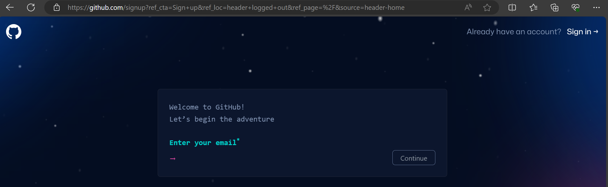
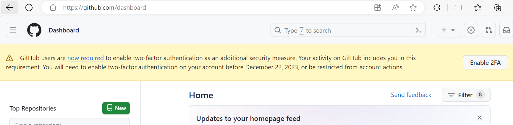
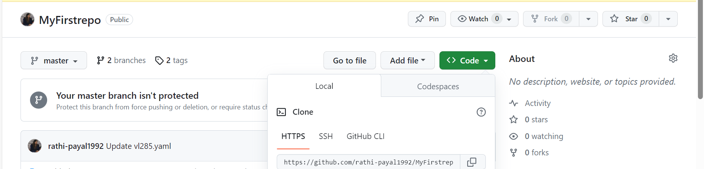
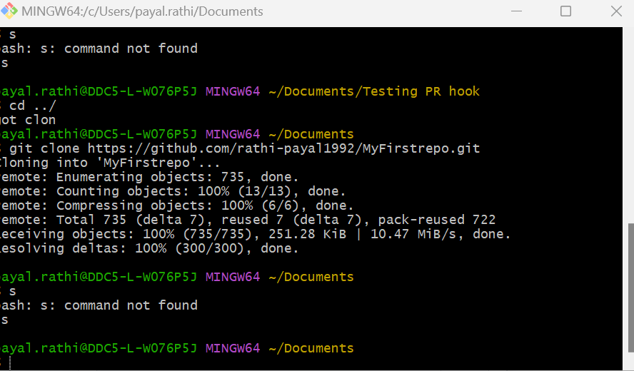
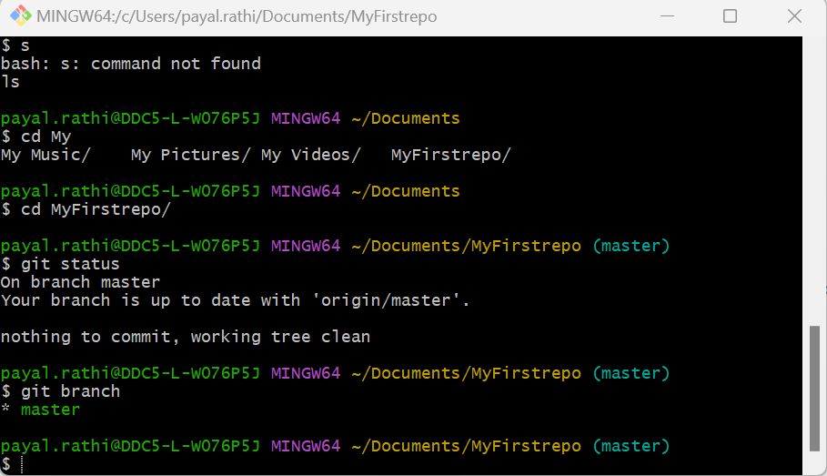

## Setting up Git bash and personal GitHub repository to practice git commands
  

 To be able to practice frequently used git commands locally one can use a personal github repo and then have git bash shell environment to interact with that repo.

 **How to create a personal GitHub Repo**

* Go to github.com and click on signup

* Enter your personal email address and create a password

  

* Once signed in, click on new to create first repository

  

You have sucessfully create your first repo.

**Installing Git Bash locally**

* On your accenture laptop, click the https://github.com/git-for-windows/git/releases/download/v2.43.0.windows.1/Git-2.43.0-64-bit.exe and download the gitbash installer

* once downloaded, run the installer and install with default options.

* Once installed, launch Git Bash by typing 'git bash' in widnows search

  

* You should now be able to run all the git commands in git bash.

  

  

